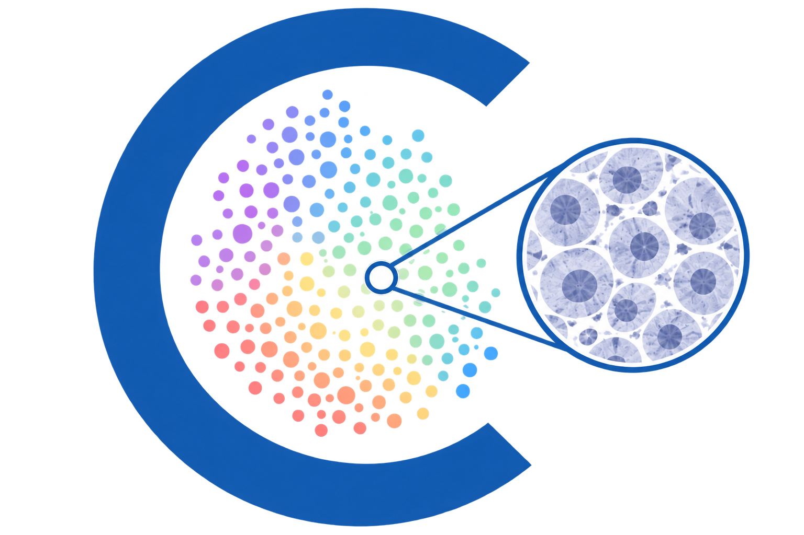

# cellsight 
`cellsight` is an enhanced R package for creating interactive, lightweight, 
and shareable web applications to explore single-cell multi-omics and spatial 
transcriptomics data. CellSight introduces powerful features tailored for modern single-cell 
modalities, including support for CITE-seq, scATAC-seq, and spatial 
transcriptomics. It integrates seamlessly with popular analysis tools like 
Seurat, Scanpy, Signac, and ArchR, and offers advanced visualizations such as 
zoom-enabled UMAPs, IGV-style peak tracks, and spatial plots—all easily 
customizable and deployable with minimal dependencies. Designed for both 
computational and experimental researchers, cellsight empowers intuitive 
exploration, cross-modality comparison, and statistical analysis of 
high-dimensional data without requiring extensive coding or setup. 

📖 **Full documentation: <https://openomics.github.io/CellSight/>** — function
reference, guides for each modality, deployment, and the template internals.

Key features of `cellsight` include:

- Supports seamless integration and visualization of single-cell multi-omics, 
peak-based, and spatial data for in-depth exploration.

- Converts data from leading analysis tools—including Scanpy, Seurat, Signac, 
and ArchR—into a lightweight, portable format suitable for local or web-based 
deployment, enabling open and accessible data sharing.

- Offers a rich collection of interactive, customizable, and publication-ready 
plots.

- Easily extendable, with support for user-defined visualizations through R for 
tailored analysis workflows.


# Table of Contents and Additional Information / Tutorials
This readme is broken down into the following sections:

- [Installation](#installation) on how to install `cellsight`

- [Docker Image](#docker-image)

- [Quick Start Guide](#quick-start-guide) to rapidly deploy a shiny app with a few lines of code

- [Frequently Asked Questions](#frequently-asked-questions)

- [Developer Template Editing Support](#developer-template-editing-support)

- [Frontend Scripting (Templates)](#frontend-scripting-templates)

- [License and Upstream Attribution](#license-and-upstream-attribution)


# Developer Template Editing Support

CellSight includes a bundled VS Code syntax extension archive for contributors
who edit R-Jinja template files (for example `*.R.jinja`):

- `inst/extdata/vscode-rjinja/rjinja-syntax.tar.gz`

See `inst/extdata/vscode-rjinja/README.md` for details on what it is, what it
does, and how to install/use it in VS Code.


# Frontend Scripting (Templates)

CellSight's frontend is generated from Jinja-based R templates. This is the
recommended workflow for customizing UI/server behavior:

1. Edit template source files under `inst/templates/`.
      - `ui.R.jinja` and `server.R.jinja` control app structure and menu layout.
      - `partials/ui/*.R.jinja` and `partials/server/*.R.jinja` control individual
           tab/page blocks.
      - `shinyFunc.R.jinja` holds shared plotting/helper functions.
2. Reinstall/reload CellSight so template changes are available.
3. Regenerate app code with `makeShinyCodes()` (after `makeShinyFiles()`).
4. Validate rendered outputs by running `tools/render-and-lint.R`.

For a full template map, context variables (`<< d.prefix >>`, `d.has_image`,
etc.), and linting/rendering details, see `inst/templates/README.md`.


# License and Upstream Attribution

CellSight is distributed under **GPL-3.0** and includes derivative work from
[`the-ouyang-lab/ShinyCell2`](https://github.com/the-ouyang-lab/ShinyCell2),
which is also GPL-3.0 licensed.

To keep downstream redistribution compliant:

- Keep the full GPL-3.0 license text with the source distribution
      (see `LICENSE`).
- Preserve upstream attribution and derivative-work notice
      (see `NOTICE`).
- Distribute modifications under GPL-3.0 terms.

The repository includes:

- `LICENSE`: full GPL-3.0 text
- `NOTICE`: upstream provenance and derivative attribution details


# Installation

## Dependency groups in `DESCRIPTION`

CellSight uses three dependency layers:

- **`Depends`**: rigid/base requirements for the CellSight package itself.
      These are required for core package functionality.
- **`Suggests`**: additional requirements for building CellSight instances,
      including modality-specific workflows (for example Seurat/Signac/ArchR)
      and developer tooling.
- **`Config/Needs/viz`**: requirements used to run the generated
      visualization application (Shiny app runtime stack).

## Building  requirements

The default required packages for CellSight are the packages required to build
a CellSight shiny app instance. These packages will be install by default when 
install installing CellSight:

```r
install.packages("CellSight", dependencies = TRUE)
```

Or if you prefer to install individually:

```r
reqPkg = c("data.table", "Matrix", "hdf5r", "reticulate", "R.utils", 
           "ggplot2", "gridExtra", "glue", "readr", "future", "RColorBrewer")
newPkg = reqPkg[!(reqPkg %in% installed.packages()[,"Package"])]
if(length(newPkg)){install.packages(newPkg)}

# If you are using Seurat object as input (for scRNA, multiomics, spatial), 
#   you can install Seurat as follows:
# install.packages("Seurat")

# If you are using Signac object for scATAC-seq, you can install Signac as follows:
# install.packages("Signac")

# If you are using ArchR object as input for scATAC-seq, visit
#   https://github.com/GreenleafLab/ArchR for ArchR's installation instruction

# If you are using h5ad file as input, run code below
# reticulate::py_install("anndata")
```

Furthermore, on the system where the Shiny app will be deployed, users can run 
the following code to check if the packages required by the Shiny app exist 
and install them if required:

```r
install.packages("pak", dependencies = TRUE)
pak::pkg_install("CellSight", dependencies = c("Depends", "Imports", "Config/Needs/viz"))
```


```r
reqPkg = c("shiny", "shinyhelper", "data.table", "Matrix", "DT", "magrittr", 
           "ggplot2", "ggrepel", "hdf5r", "ggdendro", "gridExtra", "ggpubr")
newPkg = reqPkg[!(reqPkg %in% installed.packages()[,"Package"])]
if(length(newPkg)){install.packages(newPkg)}
```

If one is deploying scATAC-seq / peak-based data, bwtools have to be installed 
for the track plots via the command line:
```bash
# Install dependencies for trackplot (on command line)
git clone https://github.com/CRG-Barcelona/libbeato.git
cd ./libbeato
git checkout 0c30432
./configure
make
make install
    
cd ..
git clone https://github.com/CRG-Barcelona/bwtool.git
cd ./bwtool
./configure
make
make check
make install
```

# Docker Image

Container assets for CellSight are available under:

- `tools/docker/CellSight/Dockerfile`
- `tools/docker/CellSight/build_cellsight.R`

Helper scripts included in the same folder:

- `tools/docker/CellSight/ingest_10x.R`
- `tools/docker/CellSight/seurat_inspector.R`

Below is a standard workflow for building, publishing, and using the image.

## Helper scripts in the Docker image

- **`ingest_10x.R`**
      - Purpose: ingest 10x Visium HD output into a Seurat object, run QC,
            normalization, PCA, clustering, and UMAP, then write an `.rds` object plus
            QC/summary plots.
      - Use this when your starting point is a raw 10x spatial output directory and
            you need a ready-to-build Seurat object for CellSight.

- **`seurat_inspector.R`**
      - Purpose: print a detailed audit of a Seurat object (assays, reductions,
            metadata columns, cluster summary, and spatial image/slide structure).
      - Use this before `build_cellsight.R` to validate object structure and catch
            missing metadata/reduction issues early.

Example helper-script usage inside the container:

```bash
docker run --rm -it \
      -v /path/to/10x_output:/input \
      -v /path/to/output:/output \
      ghcr.io/<org-or-user>/cellsight:latest \
      Rscript /usr/bin/ingest_10x.R \
      --data-dir /input \
      --outdir /output
```

```bash
docker run --rm -it \
      -v /path/to/output:/output \
      ghcr.io/<org-or-user>/cellsight:latest \
      Rscript /usr/bin/seurat_inspector.R /output/visium_hd_sample_16um.rds
```

## 1) How to build

```bash
cd CellSight/tools/docker/CellSight
docker build -t cellsight:latest .
```

## 2) How to deploy (publish image)

Tag and push to your registry of choice (example shown with GHCR):

```bash
docker tag cellsight:latest ghcr.io/<org-or-user>/cellsight:latest
docker push ghcr.io/<org-or-user>/cellsight:latest
```

If you version releases, also push a version tag:

```bash
docker tag cellsight:latest ghcr.io/<org-or-user>/cellsight:v0.0.1
docker push ghcr.io/<org-or-user>/cellsight:v0.0.1
```

## 3) How to pull down and use

Pull and run the image:

```bash
docker pull ghcr.io/<org-or-user>/cellsight:latest
docker run --rm -it ghcr.io/<org-or-user>/cellsight:latest bash
```

Run the CellSight build script inside the container (example):

```bash
docker run --rm -it \
      -v /path/to/input:/input \
      -v /path/to/output:/output \
      ghcr.io/<org-or-user>/cellsight:latest \
      Rscript /usr/bin/build_cellsight.R \
      --obj /input/seurat_obj.rds \
      --outdir /output \
      --proj "My CellSight App"
```

> Replace `<org-or-user>` and mounted paths with your real registry namespace
> and local directories.

# Quick Start Guide
In short, the `cellsight` package takes in an input single-cell object and 
generates a cellsight config `scConf` containing labelling and colour palette 
information for the single-cell metadata. The CellSight config and single-cell 
object are then used to generate the files and code required for the shiny app. 

In this example, we will use single-cell CITE-seq data in the form of a Seurat 
object containing 162,000 PBMC cells measured with 228 antibodies, taken from 
the [Seurat object](https://satijalab.org/seurat/articles/multimodal_reference_mapping.html) 
can be [downloaded here](https://zenodo.org/records/15162323/files/multimodal_pbmc.rds?download=1).

A shiny app can be readily generated using the following code:
 
``` r
library(Seurat)
library(cellsight)

seu <- readRDS("multimodal_pbmc.rds")
scConf <- createConfig(seu)
makeShinyFiles(seu,scConf, shiny.prefix="sc1", shiny.dir="shinyApp/")
makeShinyCodes(shiny.title = "PBMC multiomics", shiny.prefix="sc1",
               shiny.dir="shinyApp/")
```

The generated shiny app can then be found in the `shinyApp/` folder (which is 
the default output folder). To run the app locally, use RStudio to open either 
`server.R` or `ui.R` in the shiny app folder and click on "Run App" in the top 
right corner. The shiny app can also be deployed online via online platforms 
e.g. [shinyapps.io](https://www.shinyapps.io/) and Amazon Web Services (AWS) 
or be hosted via Shiny Server. For further details, refer to 
[Instructions on how to deploy CellSight apps online](https://htmlpreview.github.io/?https://github.com/the-ouyang-lab/cellsight-tutorial/master/docs/cloud.html).

More details on the various visualisations in the `cellsight` can be found in
[Additional information on new visualisations tailored for spatial / scATAC-seq / multiomics](https://htmlpreview.github.io/?https://github.com/the-ouyang-lab/cellsight-tutorial/master/docs/addNewVis.html)
and [Additional information on enhanced visualisation features](https://htmlpreview.github.io/?https://github.com/the-ouyang-lab/cellsight-tutorial/master/docs/addEnhanVis.html)

